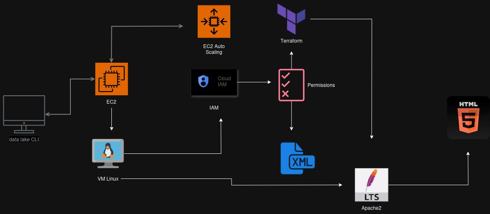

<h1>Fluxograma DevOps</h1>
    
Este é um fluxograma que descreve o processo de implementação de um ambiente DevOps, incluindo o provisionamento de instâncias EC2, uso do Terraform para gerenciamento de infraestrutura, configuração de IAM (Identity and Access Management), implementação de serviços Apache2, manipulação de arquivos XML e execução de scripts.

   <h2>Passos do Fluxograma:</h2>
    

       <h3>1. Provisionamento EC2:</h3>
        
Inicia o processo de provisionamento de uma instância EC2 na AWS.

    

  

        <h3>2. Configuração VM:</h3>
        
Configura a máquina virtual (VM) recém-criada de acordo com os requisitos do projeto.

    

  

        <h3>3. Gerenciamento de Infraestrutura com Terraform:</h3>
        
Utiliza o Terraform para gerenciar a infraestrutura como código, definindo e provisionando recursos na nuvem de forma automatizada.

    

   

        <h3>4. Configuração IAM:</h3>
        
Configura as políticas de IAM (Identity and Access Management) para garantir acesso seguro aos recursos AWS.

    

    

        <h3>5. Manipulação de Arquivos XML:</h3>
        
Realiza operações de leitura, escrita ou manipulação de arquivos XML, que podem conter configurações ou dados necessários para o ambiente.

    

  

        <h3>6. Implementação do Apache2:</h3>
        
Configura e implementa o servidor web Apache2 para hospedar e servir aplicações web.

    

   

        <h3>7. Execução de Scripts:</h3>
        
Executa scripts para automatizar tarefas específicas, como configuração adicional do ambiente ou execução de ações programadas.

    

   
Este fluxograma fornece uma visão geral do processo de implementação de um ambiente DevOps, desde a provisionamento de recursos na nuvem até a configuração e execução de serviços e scripts necessários para suportar as operações da aplicação.

